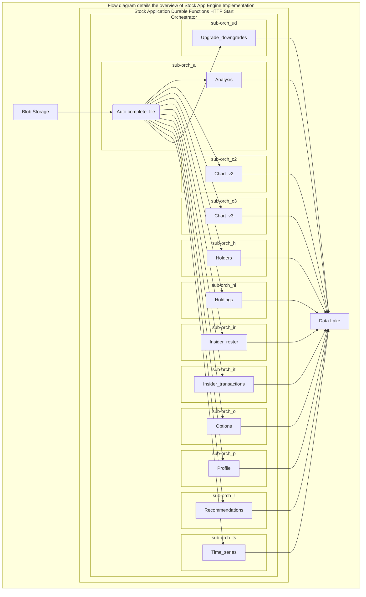

# Market Finance- Stock Application 

Stock application aims to take the extracted Auto_complete file, create a list of the query string, and pass it to analysis, chart_v2, chart_v3, holders, holdings, insider_roster, insider_transactions, options, profile, recommendations, statistics_v2, statistics_v3, time_series and upgrades to extract the individual JSON request files. All the activities are wrapped into individual sub-orchestrator and called upon the orchestrator, and then JSON response is appended and passed through the Yahoo Finance API to pull standardised API's query string for other endpoint requests, as the schema's requirements are slightly different. This execution is the final soultion, as it mitigates non-deterministic workflow and utilises the parallelisation in API calls (maximising the call request). As a result, the sucessess of API calls is increased, and this approach improves the data quality by fixing the data upstream. 

The following details the implementation of the Stock Application (end-to-end)

## Table of Contents  
- [Local System Setup](#1-local-system-setup)
- [Establish Global variables for Azure CLI](#2-establish-global-variables-for-azure-cli)
- [Create a new repository in Github](#3-create-a-new-repository-in-github)
- [Create a Azure function app](#4-create-a-azure-function-app)
- [Configure host.json file](#5-configure-hostjson-file)
- [Configure the local.settings.json file](#6-configure-the-localsettingsjson-file)
- [Create Azure function App on Azure portal](#7-create-azure-function-app-on-azure-portal)
- [Setup and Configure variables for Azure function environment](#8-setup-and-configure-variables-for-azure-function-environment)
- [Azure functions App role assigments for all the service such as blob storage, DataLake and keyvault](#9-azure-functions-app-role-assigments-for-all-the-service-such-as-blob-storage-datalake-and-keyvault)
- [Setup CI/CD for Azure function application](#10-setup-cicd-for-azure-function-application)
- [Check the configuration of the Azure function Application](#11-check-the-configuration-of-the-azure-function-application)
- [Stock Application Implementation Overview](#12-stock-application-implementation-overview)
    - [Durable Functions](#121-durable-functions)
    - [Activities](#122-activities)
        - [Analysis](#analysis)
        - [Chart_v2](#chart_v2)
        - [Chart_v3](#chart_v3)
        - [Holders](#holders)
        - [Holdings](#holdings)
        - [Insider Roster](#insider-roster)
        - [Insider Transactions](#insider-transactions)
        - [Options](#options)
        - [Profile](#profile)
        - [Recommendations](#recommendations)
        - [Time Series](#time-series)
        - [Upgrade Downgrades](#upgrade-downgrades)
    - [DurableFunction Http](#123-durablefunction-http)
    - [Orchestrator](#124-orchestrator)
    - [Shared](#125-shared)
- [Git push and Deploy](#13-git-push-and-deploy)

<a name="1-local-system-setup"/>
<a name="2-establish-global-variables-for-azure-cli"/>
<a name="3-create-a-new-repository-in-github"/>
<a name="4-create-a-azure-function-app"/>
<a name="5-configure-hostjson-file"/>
<a name="#6-configure-the-localsettingsjson-file"/>
<a name="#7-create-azure-function-app-on-azure-portal"/>
<a name="#8-setup-and-configure-variables-for-azure-function-environment"/>
<a name="#9-azure-functions-app-role-assigments-for-all-the-service-such-as-blob-storage-datalake-and-keyvault"/>
<a name="#10-setup-cicd-for-azure-function-application"/>
<a name="#11-check-the-configuration-of-the-azure-function-application"/>
<a name="#12-stock-application-implementation-overview"/>
<a name="#121-durable-functions"/>
<a name="#122-activities"/>
<a name="#analysis/">
<a name="#chart_v2"/>
<a name="#chart_v3"/>
<a name="#holders"/>
<a name="#holdings"/>
<a name="#insider-roster"/>
<a name="#insider-transactions"/>
<a name="#options"/>
<a name="#profile"/>
<a name="#recommendations"/>
<a name="#time-series"/>
<a name="#upgrade-downgrades"/>
<a name="#123-durablefunction-http"/>
<a name="#124-orchestrator"/>
<a name="#125-shared"/>
<a name="#13-git-push-and-deploy"/>


## 1. Local System Setup
```
# Check for python version 3.7 or greater
python --version

# Make sure Azure CLI is installed
az --version

# Make sure visual studio code is installed
code --version

# Make sure Azure Function Core Tools are installed
func --version

# Run az login to sign into Azure 
az login

# Turn on the param-persit option, so the varibles are automatically stored
az config param-persit on
```

## 2. Establish Global variables for Azure CLI
```
# Define the region for Application services
$service_location= <define your server location>

# Define the resource group used
$resource_group_name = <define your resource group name>

# Define the email user name for admin access 
$user_email= <define your user email address>

# Define the Blob's production container name
$abs_container_name= <define your blob storage production container name> 

# Define the Blob's archive container name
$abs_archive_container_name= <define your blob storage archive container name>

# Extract the blob storage account Id through Azure CLI
$storage_acct_id=$(az storage account show --name $storage_acct_name --resource-group $resource_group_name --query 'id' --output tsv)

# Extract the blob storage account key through Azure CLI
$storage_acct_key1=$(az storage account keys list --resource-group 
$resource_group_name --account-name $storage_acct_name --query [0].value --output tsv)

# Define the production Data Lake 
$adls_acct_name= <define your datalake account name> 
$fsys_name= <define your file root name>
$dir_name= <sub directory>

# Extract the datalake storage account key through Azure CLI
$adls_acct_key1=$(az storage account keys list --resource-group $resource_group_name --account-name $adls_acct_name --query [0].value --output tsv)

# Define the key vault name
$key_vault_name= <define your key vault name>

# Define the blob secret name
$abs_secret_name= <define your blob storage secrets name>

# Define the Data Lake secret name
$adls_secret_name= <define your data lake storage secrets name>

# Define the function application name
$funcapp_name= stocksApps
```

## 3. Create a new repository in Github
```
# git clone to the project root 
git clone <url>
```

## 4. Create a Azure function app
```
# Create a function project in the desired folder
# Make sure you are in the right folder directory 
func init stocksApp --python

# Create Python virtual environment 
python -m venv .venv

# Activate Python virtual environment
..venv\Scripts\activate

# Install the requried packages
pip install -r requirements.txt
``` 

## 5. Configure host.json file
```
# Open the host.json file and add function Time out limit
## remove the function timeout upper limit
{
    "functionTimeout": "-1"
}
```
## 6. Configure the local.settings.json file
```
# Open the local.settings file and define the following
{
    "ABS_SECRET_NAME": "abs-access-key1" <define your blob secret name stored in the secret valult>,
    "ADLS_SECRET_NAME": "adls-access-key1" <define your data lake secret name stored in the secret vault> ,
    "KEY_VAULT_NAME": "kvmarketfinance" <define your key vault name>,
    "X_RAPIDAPI_HOST": "x-rapidapi-host" <define your X_RAPIDAPI_HOST name>,
    "X_RAPIDAPI_KEY": "x-rapidapi-key <define your X_RAPIDAPI_KEY>"
}
```
## 7. Create Azure function App on Azure portal
```
# Create Function app
## Basic
subscription= <define your Azure subscription>
resouces_group= <define your resource group>
function_app_name= <define your function app name>
publish= 'code'
Runtime_stack= python
region= 'australiaEast'

## Hosting
storage_account_name= <define your blob storage account name>
operating_system= 'linux'
plan_type= 'App service plan'
linux_plan= <define your app service plan name>
sku_and_size= <select based on the app service plan>

# follow default settings for other sections
## Create
```

## 8. Setup and Configure variables for Azure function environment
```
az functionapp config appsettings set --name $funcapp_name --resource-group $resource_group_name --settings "KEY_VAULT_NAME=kvmarketfinance"
az functionapp config appsettings set --name $funcapp_name --resource-group $resource_group_name --settings "ABS_SECRET_NAME=abs-access-key1"
az functionapp config appsettings set --name $funcapp_name --resource-group $resource_group_name --settings "ADLS_SECRET_NAME=adls-access-key1"
az functionapp config appsettings set --name $funcapp_name --resource-group $resource_group_name --settings "X_RAPIDAPI_HOST= x-rapidapi-host"
az functionapp config appsettings set --name $funcapp_name --resource-group $resource_group_name --settings "X_RAPIDAPI_KEY= x-rapidapi-key"
```
## 9. Azure functions App role assigments for all the service such as blob storage, DataLake and keyvault
```
az functionapp identity assign --resource-group $resource_group_name --name $funcapp_name
$func_principal_id=$(az resource list --name $funcapp_name --query [*].identity.principalId --output tsv)
$kv_scope=$(az resource list --name $key_vault_name --query [*].id --output tsv)
az keyvault set-policy --name $key_vault_name --resource-group $resource_group_name --object-id $func_principal_id --secret-permission get list set
az role assignment create --assignee $func_principal_id --role 'Key Vault Contributor' --scope $kv_scope
az role assignment create --assignee $func_principal_id --role 'Storage Blob Data Contributor' --resource-group  $resource_group_name
az role assignment create --assignee $func_principal_id --role 'Storage Queue Data Contributor' --resource-group  $resource_group_name
```
## 10. Setup CI/CD for Azure function application
```
# Deployment center for commonApp
source= 'Github'
sign_in= <define your github username and password>
organisation= <define your organisation name>
repository= <define your repository>
branch= main
build_povider= 'GitHub Actions'
Runtime_stack= python
Version= Python 3.8
```
## 11. Check the configuration of the Azure function Application
```
# CommonApp configuration
# Application settings 
# Name value and source of 
# ABS_SECRET_NAME, ADLS_SECRET_NAME, X_RAPIDAPI_HOST, X_RAPID_API_KEY are
# referencing the key vault, if not add it manually
click edit, change and save
for value
@Microsoft.KeyVault(SecretUri=https://<key_vault_name>.vault.azure.net/secrets/<secret_name>/<version>)
```
## 12. Stock Application Implementation Overview



### 12.1 Durable functions
The durable function is an extension of Azure functions that utlisies stateful operations in a severless environment. The extension manages state, checkpoints, and restart based on the demand. Durable parts have several features that make it easy to incoporate durable orchestrations and entities into HTTP workflow.

1. Express your workflows in code
2. Retry actitives
3. Run actitives in parallel
4. Timeout workflows
5. State management for free
6. Check on workflow progress with REST API
7. Cancel workflow
8. Severless pricing model
9. Versioning made easier
10. Develop and test locally distributed

### 12.2 Activities
The Azure function activity allows running Azure functions in an Azure Data Factory pipeline. By creating a linked services connection, we can run Azure functions. The related service can control the execution plan for an Azure function.

####  Analysis
Analysis Activity is used to extract the list of the targeted company's daily analysis information. The script was written to scale and merge mulitple sources of the company's data. So the business logic takes in the Auto_complete file to extract the variables needed for the endpoint query string. The query string list runs through the function chaining (but only one function) Durable function pattern. This executes only single function at a time i.e. series execution and then awaits for all functions to finish. In our case, during the function chaining the JSON response is appended together and pushed to Data Lake and blob storage. Given the current requirements of the market scanner, only NASDAQ and ASX listed companies are used in the list consolidation. Further updates will include NZX, etc., and the necessary framework is established to accommodate the updates. 

####  Chart_v2
Chart_v2 Activity is used to extract the list of the targeted company's daily chart information. The script was written to scale and merge multiple sources of the company's data. So the business logic takes in the Auto_complete file to extract the variables needed for the endpoint query string. The query string list runs through the function chaining (but only function) Durable function pattern. This executes only single function at a time i.e. series execution and then awaits for all functions to finish. In our case, during the function chaining the JSON response is appended togther and pushed to Data Lake and blob storage. Given the current requirements of the market scanner, only NASDAQ and ASX listed companies are used in the list consolidation. Further updates will include NZX, etc., and the necessary framework is established to accommodate the updates. 

####  Chart_v3
Chart_v3 Activity is used to extract the list of the targeted company's daily chart information. The script was written to scale and merge multiple source of the company's data. So the business logic takes in the Auto_complete file to extract the variables needed for the endpoint query string. The query string list runs through the function chaining (but only function) Durable function pattern. This executes only single funtion at a time i.e. series execution and then awaits for all functions to finish. In our case, during the function chaining the JSON response is appended together and pushed to Data Lake and blob storage. Given the current requirements of the market scanner, only NASDAQ and ASX listed companies are used in the list consolidation. Further updates will include NZX, etc., and the necessary framework is established to accommodate the updates. 

####  Holders
Holders Activity is used to extract the list of the targeted company's daily holders information. The script was written to scale and merge multiple source of the company's data. So the business logic takes in the Auto_complete file to extract the variables needed for the endpoint query string. The query string lists runs through the function chaining (but only function) Durable function pattern. This executes only single function at a time i.e. series execution and then awaits for all functions to finish. In our case, during the function chaining the JSON response is appended together and pushed to Data Lake and blob storage. Given the current requirements of the market scanner, only NASDAQ and ASX listed companies are used in the list consolidation. Further updates will include NZX, etc., and the necessary framework is established to accommodate the updates. 

####  Holdings
Holdings Activity is used to extract the list of the targeted company's daily holderigs information. The script was written to scale and merge multiple source of the company's data. So the business logic takes in the Auto_complete file to extract the variables needed for the endpoint query string. The query string lists runs through the function chaining (but only function) Durable function pattern. This executes only single function at a time i.e. series execution and then awaits for all functions to finish. In our case, during the function chaining the JSON response is appended together and pushed to Data Lake and blob storage. Given the current requirements of the market scanner, only NASDAQ and ASX listed companies are used in the list consolidation. Further updates will include NZX, etc., and the necessary framework is established to accommodate the updates.

####  Insider Roster
Insider Roster Activity is used to extract the list of the targeted company's daily Roster information. The script was written to scale and merge multiple source of the company's data. So the business logic takes in the Auto_complete file to extract the variables needed for the endpoint query string. The query string lists runs through the function chaining (but only function) Durable function pattern. This executes only single function at a time i.e. series execution and then awaits for all functions to finish. In our case, during the function chaining the JSON response is appended together and pushed to Data Lake and blob storage. Given the current requirements of the market scanner, only NASDAQ and ASX listed companies are used in the list consolidation. Further updates will include NZX, etc., and the necessary framework is established to accommodate the updates.

####  Insider Transactions
Insider Transactions Activity is used to extract the list of the targeted company's daily transactions information. The script was written to scale and merge multiple source of the company's data. So the business logic takes in the Auto_complete file to extract the variables needed for the endpoint query string. The query string lists runs through the function chaining (but only function) Durable function pattern. This executes only single function at a time i.e. series execution and then awaits for all functions to finish. In our case, during the function chaining the JSON response is appended together and pushed to Data Lake and blob storage. Given the current requirements of the market scanner, only NASDAQ and ASX listed companies are used in the list consolidation. Further updates will include NZX, etc., and the necessary framework is established to accommodate the updates.

####  Options
Options Activity is used to extract the list of the targeted company's daily options information. The script was written to scale and merge multiple source of the company's data. So the business logic takes in the Auto_complete file to extract the variables needed for the endpoint query string. The query string lists runs through the function chaining (but only function) Durable function pattern. This executes only single function at a time i.e. series execution and then awaits for all functions to finish. In our case, during the function chaining the JSON response is appended together and pushed to Data Lake and blob storage. Given the current requirements of the market scanner, only NASDAQ and ASX listed companies are used in the list consolidation. Further updates will include NZX, etc., and the necessary framework is established to accommodate the updates.

####  Profile
Profile Activity is used to extract the list of the targeted company's daily profile information. The script was written to scale and merge multiple source of the company's data. So the business logic takes in the Auto_complete file to extract the variables needed for the endpoint query string. The query string lists runs through the function chaining (but only function) Durable function pattern. This executes only single function at a time i.e. series execution and then awaits for all functions to finish. In our case, during the function chaining the JSON response is appended together and pushed to Data Lake and blob storage. Given the current requirements of the market scanner, only NASDAQ and ASX listed companies are used in the list consolidation. Further updates will include NZX, etc., and the necessary framework is established to accommodate the updates.

####  Recommendations
Recommendation Activity is used to extract the list of the targeted company's daily recommendation information. The script was written to scale and merge multiple source of the company's data. So the business logic takes in the Auto_complete file to extract the variables needed for the endpoint query string. The query string lists runs through the function chaining (but only function) Durable function pattern. This executes only single function at a time i.e. series execution and then awaits for all functions to finish. In our case, during the function chaining the JSON response is appended together and pushed to Data Lake and blob storage. Given the current requirements of the market scanner, only NASDAQ and ASX listed companies are used in the list consolidation. Further updates will include NZX, etc., and the necessary framework is established to accommodate the updates.

####  Time Series
Time series Activity is used to extract the list of the targeted company's daily time series information. The script was written to scale and merge multiple source of the company's data. So the business logic takes in the Auto_complete file to extract the variables needed for the endpoint query string. The query string lists runs through the function chaining (but only function) Durable function pattern. This executes only single function at a time i.e. series execution and then awaits for all functions to finish. In our case, during the function chaining the JSON response is appended together and pushed to Data Lake and blob storage. Given the current requirements of the market scanner, only NASDAQ and ASX listed companies are used in the list consolidation. Further updates will include NZX, etc., and the necessary framework is established to accommodate the updates.

####  Upgrade Downgrades
Upgrade Downgrades Activity is used to extract the list of the targeted company's daily upgrades and downgrades information. The script was written to scale and merge multiple source of the company's data. So the business logic takes in the Auto_complete file to extract the variables needed for the endpoint query string. The query string lists runs through the function chaining (but only function) Durable function pattern. This executes only single function at a time i.e. series execution and then awaits for all functions to finish. In our case, during the function chaining the JSON response is appended together and pushed to Data Lake and blob storage. Given the current requirements of the market scanner, only NASDAQ and ASX listed companies are used in the list consolidation. Further updates will include NZX, etc., and the necessary framework is established to accommodate the updates.

### 12.3 DurableFunction Http

This feature simplifies calling HTTP APIs from your orchestrator functions. As you may know, in an orchestrator function, you're not allowed to perform any non-deterministic operations, so to call an HTTP API, you would need to call an activity function and make the HTTP request there. The Durable HTTP feature removes the need to create an additional activity function.

Durable functions have several features that make it easy to incorporate durable orchestrations and entities into HTTP workflows- and utilising async operations tracking, with the approach, if the calling API's long-running operations, it would simply return 202 and the running status. We could call the API again to find the status of the running session until the underlying activities are completed. 

### 12.4 Orchestrator
The orchestrator function is used to orchestrate the execution of other Durable functions within the function app (Stock App). The following are some of the characteristics of the orchestrator function.

    - Orchestrator functions defines function workflows using procedural code. No declarative schemas or desginers are needed. 
    - Orchestrator functions can call other durable functions synchronously and asynchronously. Output from called functions can be reliably saved to local variables.
    - Orchestrator function are durable and reliable. Execition progress is automatically checkpointed when the function "yield". Local state is never lost when the process recycles or the VM reboots. 
    - Orchestrator functions can be long-running. The total lifespan of an orchestrator instance can be seconds, days, months, or never ending. 

In addition to calling activity functions, orchestrator function can call other orchestrator functions. For example, you can build a large orchestration out of a library of smaller orchestrator functions. Or you can run multiple instances of an orchestrator function in parallel. The sub-orchestrator function behaves just like activity functions from all caller's perspective. They can return a value, throw an exception, and be awaited by the parent orchestrator function. 

For this particular execution strategy, Sub-Orchestrator were used to perform the activities. Due to the limitations of api call rates, fan-in and fan-out is not feasible and will result in non-deterministic error. So therefore, all the activities were enclosed solely within a sub-orchestrators respectively. This is done to achieve parallel execution on the orchestrating level. This was accomplished by explicitly defining a list of sub-orchestrators names and creating a provision all tasks (calling all the sub-orchestrators at once). By setting this configuration, we can run multiple device provisioning flows in parallel to facilitate the execution strategy by invoking it to the parent orchestrator.

### 12.5 Shared
Mover file is a compilation of various code snips such as, blob_container_service_client, datalake_service_client, return_blob_files, blob_storage_download, blob_storage_upload, and blob_storage_upload, data_lake_storage_upload, and blob_storage_delete. The file represents all the data mover in and out of the functions local Memeory/ Storage (blob and datalake).

# 13. Git push and Deploy
```
# commit the changes and push 
git push
```
